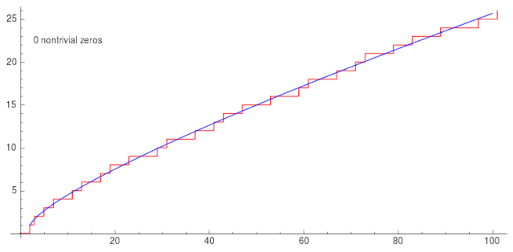

这里主要其他文件夹是没有系统学习整理过该部分的内容，后续如果进行了相应模块的系统整理，可以从这里搬移过去

# 分析

## 散度

1. [【nabla算子】与梯度、散度、旋度_哔哩哔哩_bilibili](https://www.bilibili.com/video/BV1a541127cX/?spm_id_from=333.337.search-card.all.click)
2. [【中英双语字幕】散度和旋度的动态演示，这才是解读麦克斯韦方程组的正确姿势！_哔哩哔哩_bilibili](https://www.bilibili.com/video/BV1Bt4y1C76E/?spm_id_from=333.337.search-card.all.click)
3. [拉普拉斯方程_哔哩哔哩_bilibili](https://www.bilibili.com/video/BV1tE411L72D/?spm_id_from=333.337.search-card.all.click)

散度是用于描述向量场的，它的积分定义与坐标系无关；$\nabla$是其微分定义，与坐标轴有关，并且需要导数的连续性假设。对于标量函数而言，拉普拉斯算子是该函数梯度的散度，即$\nabla\cdot\nabla f$。第一个运算是向量点乘，第二个可以看作是$f$对$\nabla$算子的数乘。

$\nabla$可以看成是坐标系$\vec{e}_i$对应的微元基$\sum\frac{\partial}{\partial x_i}\vec{e_i},\partial x_i$的变化与取值相互独立。它与标量函数的作用即可获得函数值在该基向量方向上的增量，即偏导数。$\nabla$点乘向量场，从微分的角度，它可以衡量向量场在基向量方向上对应分量的增长程度(变化率)，合起来看就是向量场的变化量与$\nabla$方向的一致程度，由于$\partial x_i$的变化相互独立，因此$\nabla$方向并不确定，但是最终在变化量趋于零时收敛至同一值，即在三个坐标轴上的分量的偏导数之和。

[怎样理解闭合面的面积分等于散度的体积分这个定理的物理意义？ - 知乎](https://www.zhihu.com/question/22418025/answer/82646654)

至于散度为什么用通量的体密度定义，首先需要通量的定义并不依赖于体积，可以是曲面。但是散度是描述空间中体积微元的汇散特性，因此是散度依赖体积微元。

## 邻域与点集

球形邻域：$U(x,\delta)=\{y|y\in S,d(x,y)<\delta\}$，注意是严格小于。

### 点集分类

1. [实变函数 点集的分类！！超简单！能听懂！(内点外点边界点，聚点外点孤立点)_哔哩哔哩_bilibili](https://www.bilibili.com/video/BV1xS4y1c7iu/?spm_id_from=333.337.search-card.all.click)
2. [内部、外部、边界与闭包_哔哩哔哩_bilibili](https://www.bilibili.com/video/BV1KX4y1d7az/?spm_id_from=333.337.search-card.all.click)
3. [10分钟彻底理解内外界、聚点和孤立点_哔哩哔哩_bilibili](https://www.bilibili.com/video/BV15h4y1R7B2/?spm_id_from=333.337.search-card.all.click)

按内外分：

1. 内点：对于$x\in S,\exist\delta>0,U(x,\delta)\sub S$。一般会记作$S^\circ$
2. 外点：对于$x\notin S,\exist\delta>0,U(x,\delta)\sub S^\complement$。可以记作$S$补集的内点，即$(S^\complement)^\circ$
3. 界点：$\forall\delta>0,U(x,\delta)\cap S\not=\empty\and U(x,\delta)\cap S^\complement\not=\empty$。一般记作$\part{S}$，这里并没有要求$x\in S$。

> 界点可以属于$S$，也可以不属于$S$

按疏密分：

1. 聚点：$\forall\delta>0,U(x,\delta)\cap S- \{x\}\not=\empty$，或者写成$\mathring{U}(x,\delta)\cap S\not=\empty$，当$x$周围$S$中内点稠密出现时，那么对于点$x$周围多小的邻域，该邻域中都包含除了$x$外$S$的其他内点，那么$x$就是$S$的聚点。
2. 孤立点：对于$x\in S,\exist\delta>0,U(x,\delta)\cap S= \{x\}$，或者写成$\mathring{U}(x,\delta)\cap S=\empty$，当$x$周围$S$中内点稀疏出现时，那么对于点$x$就可以存在一个邻域(画出这样一个圈)，使得该邻域中只包含$x$，那么$x$就被称为孤立点。(除了$x$外没有$S$的其他内点)
3. 外点

> 孤立点是针对属于集合的点，聚点可能属于集合，有可能不属于集合。
>
> 注孤立点必为界点；内点和不是孤立点的界点必为聚点；既非聚点，又非孤立点，则必为外点。
>
> 界点不要求属于集合，所以界点不一定是孤立点。

### 闭包

[欧氏空间中闭包由内点和边界组成吗？ - 知乎 (zhihu.com)](https://www.zhihu.com/question/492565929/answer/2172267091)

导集：集合$S$所有的聚点构成的集合，一般会记作$S'$

闭包：$\bar S=S\cup S'$，也可以定义为$S+\part S$，还可以定义为$S^\circ+\part S$，类似于闭区间。

### 开集、闭集

[请问开集和闭集如何理解？ - 知乎 (zhihu.com)](https://www.zhihu.com/question/378515815/answer/1073002709)

开集：开集中的每一个点都是内点。站在**开集中**的任何一个位置，往任何方向走任意充分小的距离，仍然在开集内。

闭集：全集中除去开集剩下的就是闭集。站在**闭集外**的任意一个点上，往任意方向走任意充分小的距离仍然在闭集外。如果一个集合包含它所有的边界点，那么这个集合叫做闭集。

> [证明：导集和边界集均为闭集 - 知乎 (zhihu.com)](https://zhuanlan.zhihu.com/p/640855322)

### 支撑集、紧支集

支撑集：简称支集，设$f$为拓扑空间$X$上的复值函数，$\{x∈X:f(x)≠0\}$**的闭包**称为$f$的支撑集，记为$supp(f)$。

> 闭包，意味着支撑集是一个闭集，即有界。另外支撑集中依然可能存在元素使得$f(x)=0$。

紧支集：[小白拓补学｜4. 究竟什么是紧集(compact set)？ - 知乎 (zhihu.com)](https://zhuanlan.zhihu.com/p/403213165)

>  若$supp(f)$是紧集(在$\R^n$中等价于有界闭集)，则称$f$有紧支集。
>
> 支撑集是闭集(由闭包定义)，但未必有界，如$supp(sin⁡x)=\R$。([实数集既是开集又是闭集](https://www.zhihu.com/question/24320749/answer/30204764))
>
> 紧支集要求支撑集是紧的(在$\R^n$中需有界闭)，如$supp(f)\sube[−R,R]$。

## 测度

1. [从Lebesgue外测度到Lebesgue测度 - 知乎 (zhihu.com)](https://zhuanlan.zhihu.com/p/47944282)
2. [【Lebesgue外测度与测度】：如何衡量点集的长度？_哔哩哔哩_bilibili](https://www.bilibili.com/video/BV1BRwBeqEMW/?spm_id_from=333.337.search-card.all.click)

至多可数集都是零测集，但是零测集不一定是至多可数集，反例如康托尔集。一个命题在除去一个**零测集**后成立，称它几乎处处成立。

> $[a,b]$上的有界$f$ Riemann可积$\iff f$几乎处处连续。
>
> 这也是高数里经常提到的，Riemann可积要求的"函数在闭区间上有有限个第一类（可去和跳跃）间断点"。
>
> [为什么狄利克雷函数不可积呢？ - 知乎](https://www.zhihu.com/question/350710238/answer/859682567)

外测度是对集合大小的一种"外部"估计，适用于任意集合，包括不可测集合。它通过覆盖该集合的可测集合序列来计算，并满足可数次可加性。 

测度是满足特定条件的集合的大小度量，只有当集合满足可列可加性时，即两两不交的集合，它们并的测度等于各自测度的和，才称其为可测集。 

一个集合是可测集的充要条件是满足卡拉西奥多条件(Caratheodory Condition)。

## 广义函数

1. [4.脉冲函数_哔哩哔哩_bilibili](https://www.bilibili.com/video/BV1Vw411N7hi?spm_id_from=333.788.videopod.sections&p=7)
2. [狄拉克delta函数是什么？为什么它在量子力学、傅里叶变换上有那么大的作用？_哔哩哔哩_bilibili](https://www.bilibili.com/video/BV1qu411578c/?spm_id_from=333.337.search-card.all.click)
3. [26.回顾deta函数 广义函数_哔哩哔哩_bilibili](https://www.bilibili.com/video/BV1WK411h7Jm?spm_id_from=333.788.videopod.sections)
4. [【泛函分析讲义-张恭庆】3.1 广义函数的概念（课本内容讲解） - 知乎 (zhihu.com)](https://zhuanlan.zhihu.com/p/514695737)，看上面的视频大概了解后，可以看看教材的表述。
5. [狄拉克 delta 函数 - 小时百科 (wuli.wiki)](https://wuli.wiki/online/Delta.html#note2)

泛函，指的是一个建立了从函数空间到数域的映射。笼统的说，若映射$h$使得$h:F\to \C,f\mapsto a;f\in F,a\in \C$，那么把$h$称为定义在函数空间$F$上的一个泛函。

> 变分法与泛函[从 最速降线 到 欧拉-拉格朗日方程_哔哩哔哩_bilibili](https://www.bilibili.com/video/BV1pv421y76J/?spm_id_from=333.337.search-card.all.click)

### 函数定义

广义函数是定义在某一类"性质很好"的函数空间中连续线性泛函(这个连续指的是泛函连续，即当函数序列$\{\varphi_i\}$逼近$\varphi_0$时，函数序列的泛函值将逼近$(f,\varphi_0)$，$\lim_{\varphi_i\to\varphi_0}(f,\varphi_i)=(f,\varphi_0)$)。它本质上是一个连续线性泛函。**通过观察它对其它函数的作用(如内积)来定义**。但是，它对定义域是有要求的，需要是特定的函数空间才可以。可以用$(f,\varphi)$或者$<f,\varphi>$表示广义函数$f$对检验函数$\varphi$的作用。

> 感觉写成$F_f(\varphi)$或者$f(\varphi)$也可以，就是可能会和普通函数搞混😂。

"性质很好"体现在：该空间的元素(元素是函数)是连续的，具有任意阶导数，并且任意阶导数均收敛。

> 如：任意试验函数$\varphi(x)$与它在$x=0$上的函数值$\varphi(0)$对应的广义函数称为$\delta$函数，即定义$\delta$函数为$(\delta,\varphi)=\varphi(0)$。可以按照定义证明它是连续线性的。

我们直接把具有这样筛选特点的函数成为$\delta$函数，但没有指定它的具体形式，所以需要使用弱收敛对它的函数形式进行逼近，将它当作是一些函数与检验函数$\varphi(x)$运算(可以是内积等)下弱收敛的结果。那么一些具有同样功能的函数簇$\delta_\epsilon$，在$\epsilon\to0$的条件下都将弱收敛为$\delta$。

> 下面的表述是自己的想法，不严谨，简单来说就是，参考[弱收敛](https://zhuanlan.zhihu.com/p/348809164)的定义，如果一个函数$\delta_\epsilon$在相同的运算$(\delta_\epsilon,\varphi)$下有筛选作用，即当$\epsilon\to0$时有$(\delta_\epsilon,\varphi)\to(\delta,\varphi)$，那么可以认为$\delta_\epsilon$弱收敛到$\delta$。至于$(\delta_\epsilon,\varphi)\to(\delta,\varphi)$是否真的能成立，是需要证明的。
>
> 3的从42:30开始，用$\delta$函数举例，并说明弱收敛在该定义的作用。
>
> 4中有对遇到$\delta$函数的说明，"再次强调我们不能 “按字面意思” 理解任何含有$\delta(x)$的等式"。

### 广义导数(弱导数)

1. [偏微分方程笔记(16)——弱导数、Sobolev空间 - 知乎 (zhihu.com)](https://zhuanlan.zhihu.com/p/98143530)
2. [广义导数 - 计算数学/科学计算 WiKi (reichtumqian.github.io)](https://reichtumqian.github.io/ScientificComputingWiKi/数学基础/泛函分析基础/Sobolev空间/广义导数/)，说明函数边界为零的地方有点问题，应该先强调函数连续。

对于处处有定义且无限次连续可微函数的全体$f\in C^\infin$，拥有紧支集+连续保证了其在空间边界或者无穷处取零值，因此在使用分布积分的公式时，$f(x)g(x)|^{+\infin}_{-\infin}=0$.

## 证明$1>0$

1. [复旦大学知名教授杨翎于解析几何课上严谨证明1>0的过程\_哔哩哔哩\_bilibili](https://www.bilibili.com/video/BV1wu411c7Wu/?spm_id_from=333.337.search-card.all.click)
2. [证明](https://www.zhihu.com/question/425469081/answer/1699296028)好像是在集合论的体系下。
3. [从实数的公理出发，如何证明0<1？ - 知乎 (zhihu.com)](https://www.zhihu.com/question/487067432/answer/2891636566)

## 单调有界定理

2024-03-28看[k-mean的证明](https://zhuanlan.zhihu.com/p/149597282)时遇到，与[实数的完备性定理](https://zhuanlan.zhihu.com/p/48859870)相关。

在同济版教材《高等数学》第七版里没有给出对单调有界定理的证明。

#### [确界定理](https://zhuanlan.zhihu.com/p/369595189)

[上界与上确界](https://zhuanlan.zhihu.com/p/45002244)：如果集合$S$有一个上界，那么$S$将具有无穷多个上界，其中最小上界称为上确界，记为$\sup S$。上确界不一定取得到。

[视频-确界定理证明](https://www.bilibili.com/video/BV15S4y1A7ph/?spm_id_from=333.337.search-card.all.click)——有点像在使用夹逼定理去把确界找到，以此说明确界是存在的(等分区间找一个数，然后证明按这个方法找到的这个数满足确界的两条要求)；

看过的视频：[证明以及不足近似与过剩近似](https://www.bilibili.com/video/BV1VS4y1Z7Yz/?spm_id_from=333.788.recommend_more_video.0)，[公共课(思路更连贯一点，对证明里一些不妨设的内容也有讲解)](https://www.bilibili.com/video/BV1yf4y1i7ny/?p=2&spm_id_from=pageDriver)，[确界原理的证明(思路更贴合我对这种证明方法的理解)](https://www.bilibili.com/video/BV1Eb4y1N76G/?spm_id_from=333.337.search-card.all.click)

[视频-利用确界定理证明单调有界定理](https://www.bilibili.com/video/BV1HR4y1F7RG/?spm_id_from=333.337.search-card.all.click)

# 统计与概率

### 回归和拟合的区别

2024.03.16学习机器学习的问题

[拟合（Curve fitting）与回归（Regression analysis）_回归和拟合-CSDN博客](https://blog.csdn.net/xu_fengyu/article/details/91402376)

回归这一词的[来源](https://www.zhihu.com/question/30123729/answer/554278766)。数据有回退至某个中心的趋势——>回归。回归属于拟合的一类。

回归是—种数据分析方法。拟合是—种数据建模方法。拟合侧重于调整曲线的参数，使得与数据相符。而回归重在研究两个变量或多个变量之间的关系，它可以用拟合的手法来研究两个变量的关系，以及出现的误差。

## 特征函数

[特征函数的由来及其应用 - 知乎](https://zhuanlan.zhihu.com/p/1996686967)

[中心极限定理的严格证明（思考问题的方式）_哔哩哔哩_bilibili](https://www.bilibili.com/video/BV1N34y1J7SG/?spm_id_from=333.337.search-card.all.click)

## 大数定律

大数定律是可以通过在概率公理化的定义中推导证明而得，描述的是可以通过独立同分布的试验中事件出现频率的极限值来计算概率。

概率的公理化定义中没有给出概率的计算方法，大数定律的证明说明了可以通过试验确定某事件发生的频率并把它作为相应的概率估计。

> 在概率公理化定义下，严格来说大数定律被称为定理，但是现实的试验总是符合这一规律，因此在使用频率定义概率的体系下(并不严谨)，它被称为定律。

## 相互独立的高斯随机变量的乘积的分布

1. [probability - Is the product of two Gaussian random variables also a Gaussian? - Mathematics Stack Exchange](https://math.stackexchange.com/questions/101062/is-the-product-of-two-gaussian-random-variables-also-a-gaussian)

2. [X 与 Y 相互独立且服从标准正态分布，如何求 Z=XY 的概率密度？ - 知乎 (zhihu.com)](https://www.zhihu.com/question/37400689)

## 似然函数的理解

[似然函数](https://www.zhihu.com/question/54082000/answer/470252492)

似然函数被定义为，当随机变量$X$取一定值$x$时，所选参数$\theta$下发生"$X=x$"这一事件的概率，即$L(\theta|x)=p(X=x|\theta)$

> 可以看到这两个函数有着不同的名字，却源于同一个函数。
>
> 而$p(x|\theta)$也是一个有着两个变量的函数。**如果，你将$\theta$设为常量，则你会得到一个概率函数（关于$x$的函数）；如果，你将$x$设为常量你将得到似然函数（关于$\theta$的函数）**。
>
> 这个曲线就是$\theta$的似然函数，通过了解在某一假设下，已知数据发生的可能性，来评价哪一个假设(即变量$\theta$)更接近$\theta$的真实值。

# 数论

## $\forall m,k\in N_+,f(x)=m^k\mod n$的周期性

写算法题的时候遇到的

[如何证明 f(x)=m^x mod N 的周期性？ - 知乎 (zhihu.com)](https://www.zhihu.com/question/62899790/answer/204533070)

[初等数论笔记Part 1： 欧拉定理 - 知乎 (zhihu.com)](https://zhuanlan.zhihu.com/p/35060143)

## 正整数的倍数

写算法题的时候遇到的

任意正整数的某一个倍数一定可以只由0或$k,k=\{1,2,\cdots,9\}$组成。

[任意给定一个正整数N，求一个最小的正整数M(M>1)，使得N*M的十进制表示形式里只含有1和0。_对于任意的整数n,存在全部只由1和0组成的十进制正整数-CSDN博客](https://blog.csdn.net/lionzl/article/details/11829719)

# 其他

## 同胚

[点集拓扑（12）：连续映射，同胚，嵌入 - 知乎](https://zhuanlan.zhihu.com/p/501923020)

[拓扑学中，拓扑同构和拓扑同胚有什么区别？ - 知乎](https://www.zhihu.com/question/31638975/answer/197217904)

同胚：如果$f:X\to Y$是双射，并且$f$及其逆映射$f^{-1}$都是连续的，则称$f^{-1}:Y\to X$是一个同胚映射，或称拓扑变换，或简称同胚. 当存在$X$到$Y$的同胚映射时，就称$X,Y$同胚，记作$X\cong Y$.

这个定义其实就是直接要求存在一个双射，使得两个空间的开集一一对应。

设$f:X\to Y$为连续的单射，若限制$f$的陪域得到的映射$f':X\to(f(X),\text{子拓扑})$ 为同胚，则称$f$为（拓扑）嵌入。

> [连续映射和同胚 - 小时百科](https://wuli.wiki/online/Topo1.html)
>
> 嵌入：设拓扑空间$X$和$Y$，若存在连续映射$f:X\to Y$，使得$X\cong f(X)$，那么称$f$是一个拓扑嵌入（映射）（topological embedding），称$X$由$f$嵌入（embed）到$Y$中。

## 曲面/线的切/法向量

[曲面的三个偏导数为什么能表示法向量？ - 知乎](https://www.zhihu.com/question/278342330/answer/672941786)

> 对于曲面来说，因为$A$附近的曲面不是“平的”，所以取的$B$必须“无限接近于”$A$（换句话说，实际上取不了这种$B$），也就是$\eta$要正交于每一个切向量$\alpha$。$\alpha$是$(\Delta x,\Delta y,\Delta z)$的极限，也就是$\alpha=({\mathrm d}x,{\mathrm d}y,{\mathrm d}z), \eta\,\cdot \alpha=\eta_1{\mathrm d}x+\eta_2{\mathrm d}y+\eta_3{\mathrm d}z$ . 注意到$f_x{\mathrm d}x+f_y{\mathrm d}y+f_z{\mathrm d}z=df=0$，所以三个偏导数构成的向量构成法向量。（第一个等号是全微分，第二个等号是已知的$x,y,z$所满足的曲面方程$f(x,y,z)=0$）

同济大学《高等数学》下册中，将$x,y,z$写成参数方程的形式其实就是为了表示出在这三个基向量上的微元。三个方向的增量都足够小的时候，所得向量几乎是贴着曲面的，即切向量。

对于法向量的理解，从升维的角度，对于$n$维曲面方程$F(x_1,\cdots,x_n)=0$，令$y=F(x_1,\cdots,x_n)$，那么曲面方程的偏导$F_{x_i}$组成的向量就是$y$的梯度，指向$y=0$时增长最快的方向。即$n$维的曲面的法向量指向由该曲面方程对应的$n$元函数$y$增长最快的方向。

> 类似的观点就是等势面。[曲面的三个偏导数为什么能表示法向量？ - 知乎](https://www.zhihu.com/question/278342330/answer/2146481191)

[【科普讲座】不一样的微积分：微分几何观点下dy, dx的含义_哔哩哔哩_bilibili](https://www.bilibili.com/video/BV1H6S3BbEym/)

## 欧式空间与非欧空间

看论文时对GNN应用场景的疑惑

[赋范空间](https://zhuanlan.zhihu.com/p/269589934)：假设$X$为$\R$或$\C$上的线性空间，定义范数运算$\Vert\cdot\Vert:X\to\R$，即空间到实数的映射，并满足如下条件：

1. $\Vert x\Vert\geq0$
2. $\Vert x\Vert=0\iff x=0$
3. $\Vert \lambda x\Vert=|\lambda|\cdot \Vert x\Vert$
4. $\forall x,y\in X,\Vert x+y\Vert\leq\Vert x\Vert+\Vert y\Vert$

则称$\Vert\cdot\Vert$为$X$上的范数，$(X,\Vert\cdot\Vert)$为赋范空间。

空间的完备性：[泛函分析(2) 空间完备性 - 知乎 (zhihu.com)](https://zhuanlan.zhihu.com/p/420995455)，空间中的任何柯西序列都收敛于这个空间中。

[欧式空间](https://zhuanlan.zhihu.com/p/529614863)：赋范空间+内积运算组成内积空间，欧式空间是其中一种。带有内积运算的$n$维向量空间(线性赋范空间)$\R^n$为$n$维欧氏空间。

希尔伯特空间：内积空间+完备性

流形：非欧空间，[求简要介绍一下流形学习的基本思想](https://www.zhihu.com/question/24015486/answer/194284643)，[流形](https://zhuanlan.zhihu.com/p/622263134)，[为何在数学里 Manifold 会被翻译成“流形”？ - 知乎 (zhihu.com)](https://www.zhihu.com/question/44366618)。mani-多重，fold-折叠，各种形体。

> 天地有正气，杂然赋流形。(天地之间有一股堂堂正气，它赋予万物而变化为各种体形。)
> 云行雨施，品物流形。（云气流行，雨水布施，众物周流而各自成形）

流数：[牛顿流数术 ](https://www.zhihu.com/question/32070238/answer/54633795)其实就是微积分:joy:。[从无限分割到牛顿流数，导数到底咋回事？_哔哩哔哩_bilibili](https://www.bilibili.com/video/BV1Ji421r75X/?spm_id_from=333.337.search-card.all.click)

### 数据域

[欧几里得结构数据与非欧几里得结构数据](https://blog.csdn.net/LoseInVain/article/details/88373506)

**欧几里得数据**：具有很好的平移不变性的数据。

平移不变性——不管图像中的目标被移动到图片的哪个位置，得到的结果(标签)相同。

对于这类数据以其中一个像素为节点，其邻居节点的数量相同(排列规整)。可以很好的定义一个全局共享的卷积核(相当于特征检测器)来提取图像中相同的结构。

常见这类数据有图像、文本、语言。

**非欧几里得数据**：主要有两大类——图(graph)数据和流形(manifold)数据。

这两类数据有个特点就是，排列不整齐，比较的随意。具体体现在：对于数据中的某个点，难以定义出其邻居节点出来，或者是不同节点的邻居节点的数量是不同的，这样就意味着难以在这类型的数据上定义出和图像等数据上相同的卷积操作出来，而且因为每个样本的节点排列可能都不同。

标准卷积网络不能简单有效地处理图数据的解释：如果直接对图进行普通卷积运算，那么需要考虑卷积核的大小，而由于图中的节点并不一定具备相同的邻居节点数。如果使用一个固定大小的卷积核，并试图采用增删邻居节点的方法得到相同数量的邻居节点，原本邻居数量少的节点可以通过“虚补”邻居解决；但是对应原本邻居节点数量多的节点，需要删减或抽样选取，这么做会破坏原本图的拓扑性质(图像的抽样对附近特征的影响并不大)，对图特征的影响会很大(相连点的度数反应了图的同构性，也会影响节点的路径)，因此会影响特征提取(特征的传播或者聚合)的效果。
[解释参考1-GNN](https://zhuanlan.zhihu.com/p/115322434)
[解释参考2-GNN](https://www.zhihu.com/question/54504471/answer/332657604)

## 黎曼猜想

[【漫士科普】为什么数学不允许除以0，却定义了根号-1？_哔哩哔哩_bilibili](https://www.bilibili.com/video/BV164421U7ya/?spm_id_from=333.337.search-card.all.click)

### 科普

1. [黎曼猜想，到底猜了个啥？](https://www.bilibili.com/video/BV1A2421N7Gx/?spm_id_from=333.337.search-card.all.click)
2. [【官方双语】黎曼ζ函数与解析延拓的可视化](https://www.bilibili.com/video/BV1tx411y7VG/?spm_id_from=333.337.search-card.all.click)

3. [素数（一）目前已知最大的素数是多少？梅森素数是什么？关于素数那点事儿](https://www.bilibili.com/video/av32186751/?spm_id_from=333.788.video.desc.click)；[素数（四）黎曼猜想中的非平凡零点和素数的分布规律有什么关系？_哔哩哔哩_bilibili](https://www.bilibili.com/video/BV15W411m7SY/?spm_id_from=333.1387.search.video_card.click)
4. [1+2+3+4+...=-1/12？李永乐老师讲黎曼猜想（1）](https://www.bilibili.com/video/BV1MW411S7Tg/?spm_id_from=333.337.search-card.all.click)解析延拓导致了这些奇奇怪怪的求和式

感受黎曼素数计数函数拟合真实的素数个数分布的震撼，[图出处](https://zhuanlan.zhihu.com/p/336672384)。近似过程中黎曼素数计数函数使用非平凡零点的数量越多，近似曲线就越趋近于原来的素数个数阶梯函数。(像极了傅里叶级数拟合矩形波)

### 膜拜

1. [读懂黎曼猜想 - 知乎 (zhihu.com)](https://www.zhihu.com/column/c_1419093555923615744)

2. [TravorLZH的"困扰"](https://www.zhihu.com/question/413178224/answer/1410075200)

3. [On Riemann's Paper, "On the Number of Primes Less Than a Given Magnitude"](https://arxiv.org/pdf/1609.02301.pdf)
4. [黎曼论文原文英译](https://www.maths.tcd.ie/pub/HistMath/People/Riemann/Zeta/EZeta.pdf)

## 约束优化

[最优化理论与方法-第八讲-约束优化（一）：KKT条件_哔哩哔哩_bilibili](https://www.bilibili.com/video/BV1Tt4y127U1/?spm_id_from=333.337.search-card.all.click)

看到定义“切锥”和“可行方向”区别的一点关于定义适用范围的感受：切锥用点列定义，而可行方向用线段定义，形成点列的要求比形成线段的要求更松，意味着使用点列进行的定义要比使用线段进行的定义能适用于更多情况。类似的，极限的定义同样是依赖于点列。

[Karush-Kuhn-Tucker (KKT)条件有关拉格朗日乘子的取值](https://zhuanlan.zhihu.com/p/38163970)

在拉格朗日乘子法中：对于等式约束，$\lambda\neq0$即可，保证约束有效。对于不等式，$\lambda\ge0$，其中对于有效约束，和等式约束一样$\lambda\neq0$，但还需要保证有效约束的线性组合是目标函数的下降方向，故$\lambda>0$；对于无效约束，使$\lambda=0$，两者共同保证$\lambda_ig_i(x^*)=0$：
$$
\begin{cases}
\lambda_j=0,g_j(x^*)<0&j\in \text{非有效约束集}\\
\lambda_k>0,g_k(x^*)=0&k\in \text{有效约束集}
\end{cases}
$$
因此称作互补松弛。
